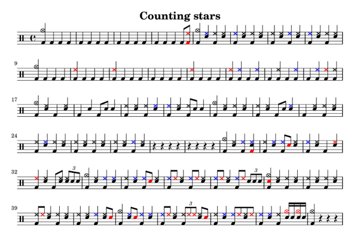
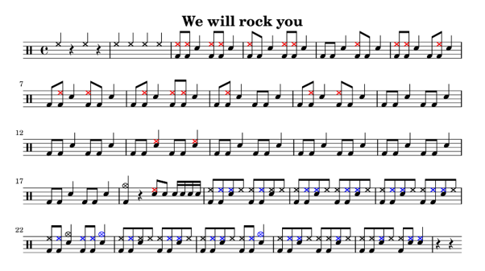
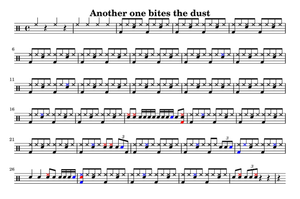

# 🥁 Drum Transcription App

An automatic drum transcription application that converts audio files into sheet music and MIDI using deep learning. This project was developed as part of the **Digital Techniques III** course in the Electronic Engineering program at **UTN FRSN** (Universidad Tecnológica Nacional - Facultad Regional San Nicolás).


## ✨ Features

- **Audio Upload**: Supports `.wav` and `.mp3` file formats
- **Drum Track Separation**: Isolates drums from full mixes using [Demucs](https://github.com/facebookresearch/demucs)
- **Onset Detection**: Identifies drum hits with precision using librosa
- **Beat Detection & Alignment**: Automatically detects tempo and aligns notes to the beat grid
- **Drum Part Classification**: Uses a ResNet-based CNN to classify drum components (Kick, Snare, Hi-Hat, Crash)
- **Sheet Music Generation**: Creates professional drum notation using LilyPond and Abjad
- **MIDI Export**: Generates MIDI files for use in DAWs
- **Downloadable Outputs**: Export sheet music (PDF), LilyPond source, and MIDI files

## 📸 Example Outputs

<table>
  <tr>
    <td><br/><i>Counting Stars - OneRepublic</i></td>
    <td><br/><i>We Will Rock You - Queen</i></td>
  </tr>
  <tr>
    <td colspan="2" align="center"><br/><i>Another One Bites the Dust - Queen</i></td>
  </tr>
</table>

## 🏗️ Architecture

```
┌─────────────────────────────────────────────────────────────────────────────┐
│                              Audio File (.wav/.mp3)                         │
└─────────────────────────────────────────────────────────────────────────────┘
                                       │
                                       ▼
┌─────────────────────────────────────────────────────────────────────────────┐
│                    Drum Track Separation (Demucs)                           │
│                    Isolates drums from vocals, bass, and other instruments  │
└─────────────────────────────────────────────────────────────────────────────┘
                                       │
                                       ▼
┌─────────────────────────────────────────────────────────────────────────────┐
│                    Audio Analysis (librosa)                                 │
│  ┌─────────────────────────┐    ┌─────────────────────────────────────────┐ │
│  │   Onset Detection       │    │   Beat Detection & Tempo Estimation     │ │
│  │   (drum hit times)      │    │   (beat grid alignment)                 │ │
│  └─────────────────────────┘    └─────────────────────────────────────────┘ │
└─────────────────────────────────────────────────────────────────────────────┘
                                       │
                                       ▼
┌─────────────────────────────────────────────────────────────────────────────┐
│                    Drum Part Classification (ResNet CNN)                    │
│                    200ms audio clips → MEL spectrograms → Neural Network    │
│                    Classes: Kick Drum (KD), Snare (SD), Hi-Hat (HH),        │
│                             Crash Cymbal (CR)                               │
└─────────────────────────────────────────────────────────────────────────────┘
                                       │
                                       ▼
┌─────────────────────────────────────────────────────────────────────────────┐
│                    Sheet Music Generation                                   │
│  ┌───────────────────┐  ┌───────────────────┐  ┌───────────────────────────┐│
│  │  LilyPond (.ly)   │  │      PDF          │  │         MIDI              ││
│  │   source file     │  │   sheet music     │  │     for DAWs              ││
│  └───────────────────┘  └───────────────────┘  └───────────────────────────┘│
└─────────────────────────────────────────────────────────────────────────────┘
```

## 🧠 Machine Learning Model

### Model Architecture

The drum classification uses a **Residual Neural Network (ResNet)** architecture optimized for audio classification:

- **Input**: MEL spectrograms (200ms audio clips at 44.1kHz)
- **Architecture**: 6 residual blocks with skip connections
- **Output**: Multi-label classification (sigmoid activation)
- **Loss Function**: Binary Cross-Entropy
- **Optimizer**: Adam with learning rate scheduling
- **Regularization**: Dropout (0.5) and early stopping

### Training Details

| Parameter | Value |
|-----------|-------|
| Sample Rate | 44,100 Hz |
| Clip Size | 200 ms |
| FFT Size | 1,024 |
| Hop Length | 256 |
| Validation Split | 20% |

### Dataset

The model was trained on:
- **[Drum Dataset](https://huggingface.co/datasets/Pattr/Drum-dataset)** from Hugging Face
- **Custom recordings** of additional drum samples
- **Data Augmentation** using [Audiomentations](https://github.com/iver56/audiomentations) library

### Metrics

The model is evaluated using:
- Accuracy
- Precision
- Recall
- F1-Score (per class)

### Why ResNet?

Initially, digital filters were explored to distinguish drum components, but this approach proved unfeasible due to overlapping frequency spectra between different drums and variations across drum kits.

A simple CNN was then attempted but failed to generalize properly. The ResNet architecture with skip connections provided the depth needed for better feature extraction while avoiding the vanishing gradient problem, resulting in significantly improved performance.

## 📁 Project Structure

```
transcribir-bateria/
├── app.py                    # Main Streamlit application
├── config.py                 # Configuration parameters
├── separation.py             # Demucs drum separation
├── transcription.py          # Transcription pipeline
├── session_state.py          # Streamlit state management
├── file_uploader.py          # File upload handling
├── ui_components.py          # UI elements and styling
├── requirements.txt          # Python dependencies
├── packages.txt              # System dependencies
│
├── audio/                    # Audio processing modules
│   ├── loader.py             # Audio file loading
│   ├── onset_detection.py    # Drum hit detection
│   ├── beat_detection.py     # Tempo and beat tracking
│   └── beat_alignment.py     # Note-to-beat alignment
│
├── prediction/               # ML prediction module
│   └── drum_part_predictor.py # Spectrogram → drum classification
│
├── notation/                 # Sheet music generation
│   └── sheet_music_generator.py # LilyPond/Abjad conversion
│
├── training/                 # Model training scripts
│   ├── main.py               # Training entry point
│   ├── model.py              # CNN and ResNet definitions
│   ├── dataset.py            # Data loading and preprocessing
│   ├── preprocess.py         # Audio preprocessing
│   ├── filters.py            # Audio filters
│   └── config.py             # Training configuration
│
├── models/                   # Trained model files
│   └── model_*.keras         # Saved Keras model
│
└── docs/examples/            # Example outputs
    ├── counting_stars.png
    ├── we_will_rock_you.png
    └── another_one_bites_the_dust.png
```

## 🚀 Installation

### Prerequisites

- Python 3.8+
- [LilyPond](https://lilypond.org/) (for sheet music generation)
- FFmpeg (for audio processing)

### Setup

1. **Clone the repository**
   ```bash
   git clone https://github.com/yourusername/drum-transcription-app.git
   cd drum-transcription-app
   ```

2. **Create a virtual environment** (recommended)
   ```bash
   python -m venv venv
   source venv/bin/activate  # On Windows: venv\Scripts\activate
   ```

3. **Install Python dependencies**
   ```bash
   pip install -r requirements.txt
   ```

4. **Install LilyPond**
   - Download from [lilypond.org](https://lilypond.org/)
   - Ensure it's added to your system PATH

5. **Run the application**
   ```bash
   streamlit run app.py
   ```

6. **Open your browser**
   Navigate to `http://localhost:8501`

## 📖 Usage

1. Upload an audio file (`.wav` recommended for best accuracy)
2. Configure transcription settings (tempo, time signature)
3. Click "Generate Transcription"
4. Wait for processing (drum separation + analysis)
5. Download the generated files:
   - **PDF**: Sheet music
   - **MIDI**: For DAW import
   - **LilyPond**: Source file for further editing

## ⚠️ Known Limitations

| Issue | Description |
|-------|-------------|
| **Limited Drum Parts** | Currently only detects Kick, Snare, Hi-Hat, and Crash. Toms and Ride are not supported yet. |
| **Variable Tempo** | Works best with songs that have a consistent tempo. Songs with tempo changes may produce alignment errors. |
| **Audio Bleed** | Some residual sounds from other instruments may remain after separation, affecting transcription accuracy. |
| **False Positives** | Occasional ghost notes or missed hits may occur, requiring manual correction. |
| **Drum Kit Variation** | Performance may vary across different drum kits and recording styles. |

## 🔮 Future Improvements

- [ ] Add support for **Toms** and **Ride Cymbal** detection
- [ ] Implement **dynamic tempo detection** for variable BPM songs
- [ ] Improve onset detection algorithm for cleaner hit detection
- [ ] Expand dataset with more diverse drum kits and genres
- [ ] Add real-time transcription capability
- [ ] Implement a web-based editor for manual corrections

## 🛠️ Tech Stack

| Category | Technologies |
|----------|-------------|
| **Frontend** | Streamlit |
| **Audio Processing** | librosa, soundfile, ffmpeg |
| **Source Separation** | Demucs (Meta AI) |
| **Machine Learning** | TensorFlow/Keras, scikit-learn |
| **Sheet Music** | LilyPond, Abjad |
| **Data Augmentation** | Audiomentations |

## 🙏 Acknowledgments

- [Demucs](https://github.com/facebookresearch/demucs) by Meta AI for the source separation model
- [Abjad](https://abjad.github.io/) for programmatic music notation
- [LilyPond](https://lilypond.org/) for high-quality sheet music engraving
- [librosa](https://librosa.org/) for audio analysis
- [Drum Dataset](https://huggingface.co/datasets/Pattr/Drum-dataset) from Hugging Face

## 📄 License

This project is open source and available under the [MIT License](LICENSE).

---

<p align="center">
  Developed as part of <b>Digital Techniques III</b> course<br>
  Electronic Engineering @ <b>UTN FRSN</b><br>
  2024
</p>
